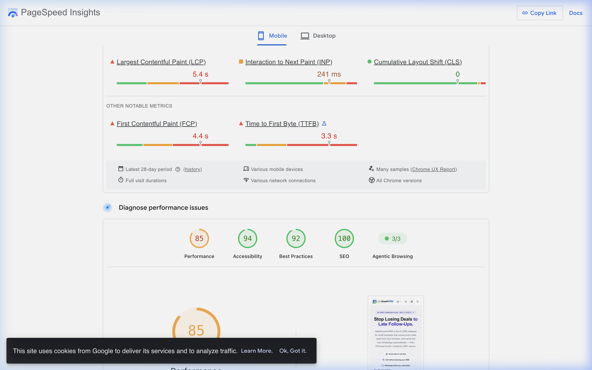

# HelloGrowthCRM Technical Audit — Front-End Performance & SEO


A comprehensive technical audit of [https://hellogrowthcrm.com](https://hellogrowthcrm.com) covering **Mobile PageSpeed Core Web Vitals**, **Top 3 Prioritized Performance Fixes**, and **Page Source SEO Canonical Analysis** prepared for the Front End Development screening task.

---

## 📌 Executive Summary

* **Candidate**: Jeevan M
* **Target Website**: `https://hellogrowthcrm.com` (Homepage)
* **Audit Scope**: PageSpeed Insights (Mobile Viewport) & View Page Source Analysis
* **Submission File**: [`Jeevan_M.pdf`](./Jeevan_M.pdf) (Exact 3-page submission PDF)

---

## 📊 Task 1 — Mobile PageSpeed Audit & Baseline Metrics



### Core Web Vitals & Diagnostic Breakdown

| Metric Name | Real-User Field Data (CrUX) | Lighthouse Lab Data | Benchmark & Status |
| :--- | :--- | :--- | :--- |
| **Performance Score** | **85 / 100** | **85 / 100** | 🟠 Needs Improvement |
| **Largest Contentful Paint (LCP)** | **5.4 s** | **3.7 s** | 🔴 **Poor (> 2.5s) — FAILED** |
| **Interaction to Next Paint (INP)** | **241 ms** | **160 ms (TBT)** | 🟠 Needs Improvement (> 200ms) |
| **Cumulative Layout Shift (CLS)** | **0.00** | **0.006** | 🟢 **Good (< 0.1) — PASSED** |
| **First Contentful Paint (FCP)** | **4.4 s** | **2.0 s** | 🔴 Poor (> 1.8s) |
| **Time to First Byte (TTFB)** | **3.3 s** | **—** | 🔴 Poor (> 0.8s) |

---

## ⚡ Task 2 — Top 3 Performance Fixes (Prioritized by Impact)

### Fix #1: Optimize TTFB & Edge HTML Caching to Unblock LCP
* **Target Metric**: `LCP` (Largest Contentful Paint) & `FCP` (First Contentful Paint)
* **Why**: Real-user field data indicates a high Time to First Byte (`TTFB = 3.3s`) and First Contentful Paint (`FCP = 4.4s`). Because LCP elements cannot begin rendering until the initial document HTML is fully received, server response latency directly limits mobile LCP to 5.4s.
* **Evidence**: PageSpeed Mobile Field Data (`TTFB: 3.3s`, `FCP: 4.4s`, `LCP: 5.4s`) establishing initial HTML network wait time as the dominant delay factor.
* **Action Plan**: Implement Edge SSR / CDN Stale-While-Revalidate caching (via Vercel Edge / Cloudflare) for marketing page HTML and optimize database queries.
* **Estimated Improvement**: **`LCP −1.5s to −2.5s`** | **`FCP −1.5s to −2.5s`**

---

### Fix #2: Defer Non-Critical Next.js JavaScript & Hydration Bundles
* **Target Metric**: `INP` (Interaction to Next Paint)
* **Why**: PageSpeed flags 85 KiB of unused JavaScript and 4 long main-thread execution tasks. Page source inspection reveals 15+ static Next.js JS chunks (`/_next/static/chunks/...`) loaded in `<head>`. Main-thread blockages during script evaluation create input delay when users tap buttons or links.
* **Evidence**: PageSpeed Audit "Reduce unused JavaScript" (85 KiB savings), 4 Long Tasks, and 15+ chunk script tags in the HTML `<head>`.
* **Action Plan**: Code-split below-the-fold components using Next.js `dynamic()` imports with `{ ssr: false }` and load interactive scripts after main thread idle state via `requestIdleCallback`.
* **Estimated Improvement**: **`INP −40ms to −80ms`** *(Brings INP from 241ms into the <200ms "Good" green threshold)*

---

### Fix #3: Remove Duplicate Preloads & Refine Mobile Hero Image Sizing
* **Target Metric**: `LCP` (Largest Contentful Paint)
* **Why**: Page source analysis reveals duplicate `<link rel="preload" as="image">` tags in the HTML `<head>`. Serving high-resolution desktop WebP image variants alongside mobile variants without narrow media query constraints leads to redundant bandwidth usage on mobile cellular networks.
* **Evidence**: HTML page source lines featuring duplicate `<link as="image" fetchpriority="high" imagesrcset="/og/dashboard-hero-640.webp 640w, /og/dashboard-hero.webp 900w" rel="preload"/>` tags.
* **Action Plan**: Deduplicate preload tags in HTML generation and attach explicit media queries (e.g. `media="(max-width: 640px)"`) to ensure mobile viewports fetch strictly sized assets.
* **Estimated Improvement**: **`LCP −0.4s to −0.8s`**

---

## 🔍 Task 3 — SEO Problem Identified from Page Source

### Issue: Self-Referential Canonical URL & Open Graph Target Mismatch on Root Homepage

#### Exact HTML Evidence (Extracted directly from `View Page Source` of `https://hellogrowthcrm.com/`)

```html
<!-- Page URL requested: https://hellogrowthcrm.com/ -->
<link rel="canonical" href="https://hellogrowthcrm.com/in" />
<meta property="og:url" content="https://hellogrowthcrm.com/in" />
```

#### Why it hurts SEO
When search engine crawlers (such as Googlebot) access the primary root domain (`https://hellogrowthcrm.com/`), the canonical tag explicitly points to the regional subpath (`/in`). This self-referential canonical mismatch instructs search engines to treat the primary homepage as duplicate content of the regional subpath. As a result, search engines consolidate indexing signals and organic ranking authority onto `/in`, causing external backlinks, domain authority, and social sharing signals aimed at `hellogrowthcrm.com` to suffer link equity dilution and canonical indexing conflicts.

---

## 📂 Repository Structure

```text
hellogrowthcrm-audit/
├── Jeevan_M.pdf                 # Final 3-page submission PDF document
├── README.md                    # Detailed audit report & task findings
├── .gitignore                   # Git exclusion rules
├── assets/
│   └── pagespeed_screenshot.png # High-res Mobile PageSpeed Insights screenshot
└── scripts/
    └── parse_html.py            # Python script used to analyze HTML page source
```

---

## 🛠️ Usage & Verification

### Running the Page Source Parser
```bash
python3 scripts/parse_html.py
```

### Viewing the Submission PDF
The submission document is compiled as **`Jeevan_M.pdf`** in the repository root directory. You can open it directly with any standard PDF reader or browser.

---

*Submitted by Jeevan M for Front End Development Internship Screening.*
